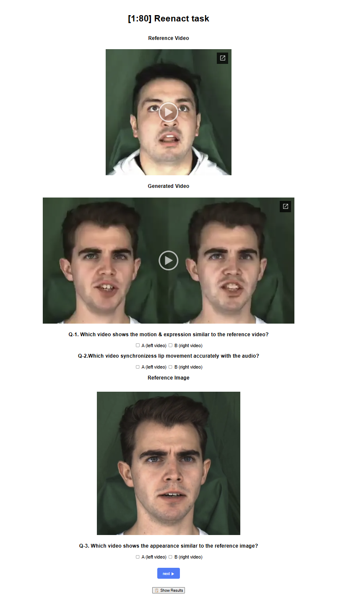

# User study

[Click here to start Userstudy!](https://chacorp.github.io/userstudy2/)

## How to run user study

1. Watch the reference video

2. Watch the generated video.

3. Answer the first two questions. (Q-1, Q-2)

4. Look at the reference image.

5. Answer the last question. (Q-3)

6. Press next to move on.

7. Repeat this process untill you reach the end of the page!

*Note: if you dont answer to all question, the page will not move to the next video.

## How to send answer
There are 80 examples for this user study. \
*The numbers at the top of the page indicates the progress of the user study

If you have answered questions for all 80 videos, follow the steps below.

1. Scroll down to the end of the page and press ``Show Results``. 

    

2. Your answer will show up. Scroll down to the end and press the ``Press this to copy the result`` button.

    

3. Now your answer is copied to the clipboard. please send the copy to me..!